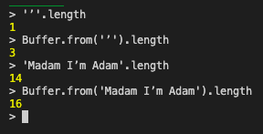

_TLDR; The fix is therefore to use Buffer.from(string).length to set `Content-Length` instead of string.length._


## What's Content-Length?

It's an HTTP header both the client and the server use to denote the size of the request/response body.


## Story time

* Was working with a POST API endpoint that expected some text in the request body. 

* The code was already in place and we faced issues where some requests were failing and we couldn't reproduce it in other environments.
(_Mistake: Didn't use the exact same text to reproduce in other env_)


After spending hours and days debugging this issue, we found out that the API was returning a JSON parse error. 

The request body that looked something like this

`{
  "text": "Madam I’m Adam"
}`

Simple json, JSON parse error? Whaat? 

The culprit : `Content-Length`. 

The call looked something like this

```
fetch(url, {
  headers: {
    'Content-Type': 'application/json',
    'Content-Length`: requestBody.length
  },
  body: requestBody
})
```
## The Issue

 When there's a non ascii, multi-byte character, such as this apostrophe for example `’`, which is different from the regular `'`, string.length can't be used to calculate `Content-Length`.

 While string.length gives the size of the string, it is only the character count. It's not the actual size the string takes up in bytes/octets.
 
 MDN [says `Content-Length`](https://developer.mozilla.org/en-US/docs/Web/HTTP/Headers/Content-Length) is `The length in decimal number of octets.`

See the difference here. We can use Buffer.from(string).length to get the actual size of the string




So string.length gives a lower value than the actual size of the request body. API looks at the lower Content-Length chops off the last few bytes, what that means is the request might end up lookin like this


`{
  "text": "Madam I’m Adam"
`

Notice the missing `}`. This causes the JSON parse error. 

The fix is therefore to use Buffer.from(string).length to set `Content-Length`.

_FYI: GET with Request Body requires us to send Content-Length header explicitly, whereas for PUT & POST you can choose to not send it._